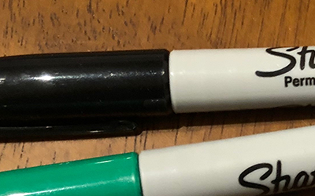

### Build up
```
cargo build
```
### Run
```
cargo run --release <SUBCOMMAND> <INPUT FILE> <OUTPUT FILE> <ADDITIONAL_PARAMETERS>
Example:
cargo run --release blur assets/pens.png assets/pens_blurred.png 2.5
```
Notes: Image processing is very CPU-intensive.  Your program will run *noticeably* faster if you run it with the `--release` flag.
<br/>

## Photo filters result

### Invert effect
```
cargo run --release invert assets/pens.png assets/pens_inverted.png
```


### Blur effect
```
cargo run --release blur assets/pens.png assets/pens_with_blur.png 2.5
```


### Crop effect
```
cargo run --release crop assets/pens.png assets/pens_cropped.png 200 300 400 250
```


### Gray effect
```
cargo run --release grayscale assets/pens.png assets/pens_gray.png
```
